# PhyPiDAQ Dokumentation (für Lehrkräfte)
---  

Dies ist die deutsche Version der Dokumentation für Lehrkräfte von PhyPiDAQ, 
einem Paket zur Aufnahme, Speicherung, Visualisierung und Auswertung von Messdaten
mit dem [Raspberry Pi](https://www.raspberrypi.com/).

Here is the [English version](Documentation_en.md).  

---  

In dieser Anleitung wird der gesamte Workflow von PhyPiDAQ, begonnen von der Installation bis hin zur Auswertung von Versuchen beschrieben.

- [Was ist PhyPiDAQ ?](#wasistphypidaq)
- [Was brauche ich und wie baue ich das zusammen ?](#wasbraucheichundwiebaueichdaszusammen)
- [Wie setze ich den Raspberry Pi auf und installiere PyPiDAQ?](#wiesetzeichdenraspberrypiaufundinstalliereichphypidaq)
    - [Wie setze ich den Raspberry Pi auf ?](#wiesetzeichdenraspberrypiauf)
    - [Wie installiere ich PhyPiDAQ ?](#wieinstalliereichphypidaq)
- [Wie bediene ich die PhyPiDAQ Software ?](#wiebedieneichdiephypidaqsoftware)
    - [Starten und Startoberfälche](#startenundstartoberflaeche)
    - [Konfigurationsdatei](#konfigurationsdatei)
    - [Messung starten](#messungstarten)
- [Wie führe ich damit Versuche durch ?](#wiefuehreichdamitversuchedurch)
	- [Elektrostatik](#elektrostatik)
	- [Kraftsensor](#kraftsensor)
	- [Photoeffekt](#photoeffekt)


<a name="wasistphypidaq"></a>

## 1. Was ist PhyPiDAQ ? 
PhyPiDAQ ist ein Projekt zur transparenten, einfach verständlichen Datenerfassung mit einem Raspberry Pi. Die Software enthält grundlegende Funktionen zur Datenaufnahme und -visualisierung wie Datenlogger, Balkendiagramm, XY- oder Oszilloskopanzeige und Datenaufzeichnung auf die Festplatte zur anschließenden Auswertung.

Die Bedienoberfläche ist so gestaltet, dass vorgefertigte Templates für viele Sensoren benutzt werden können, um diese somit einfach und schnell auszulesen. Darüber hinaus bietet sie aber auch die Möglichkeit, die einzelnen Parameter wie Abtastrate, Intervall, Achsenbeschriftung, Differentieller Modus, Funktionen zur direkten Umrechnung und viele mehr zu verändern. Die Einstellungen lassen sich bequem abspeichern und wieder aufrufen, sodass ein Demonstationsversuch schnell gezeigt werden kann.

Es wird bereits eine Vielzahl unterschiedlicher Sensoren, wie verschiedene Analog-Digital-Wandler, Stromsensoren, Klimadatensensoren, Gammadetektoren etc. unterstützt. Hierbei wurde auf weit verbreitete und preiswerte Sensoren gesetzt, welche eine hohe Genauigkeit aufweisen, die für Schulversuche mehr als ausreichend ist.

Die Sensoren können einzeln mittels sogenannter Jumper-Kabeln mit dem Raspberry Pi verbunden werden, oder es kann die eigens für PhyPiDAQ entworfene Platine verwendet werden, auf welcher die Sensoren fest angebracht werden. Dadurch kann der Verkabelungsaufwand auf ein Mindestmaß reduziert werden und Versuche können auch schnell in der 5-Minuten-Pause aufgebaut werden. Mit maßgeschneiderten 3D-gedruckten Modellen kann alles geräumig in einem Organizer-Koffer befestigt werden.  

 *Abb. 1*:  Darstellung der Zeitabhängigkeit von zwei Signalquellen 
              (Kondensatorspannung an Rechteckspannung) an einem AD-Wandler  
                      

*Abb. 2*:  Messkoffer mit Raspberry Pi, Vorschaltplatine und eingebautem Display  
                      

<a name="wasbraucheichundwiebaueichdaszusammen"></a>
## 2. Was brauche ich und wie baue ich das zusammen ?  

Sensoren und Standardverstärker sind das Herzstück des PhyPiDAQ-Projekts. 
Eine Reihe von analogen und digitalen Sensoren werden von der PhyPiDAQ-Software 
unterstützt, die quelloffen ist und vom 
[PhyPiDAQ Github-Repository](https://github.com/PhyPiDAQ/PhyPiDAQ) 
heruntergeladen werden.  
Die detaillierte Vorgehenswese zur Installation der Software ist 
[hier](#wiesetzeichdenraspberrypiauf) beschrieben.

Sensoren können direkt an die GPIO-Pins des Raspberry Pi angeschlossen werden, 
und ein ein externes Steckbrett kann verwendet werden, um schwache Signale zu 
verstärken, falls dies notwendig sein sollte. 

Ein Vorschlag für einen Messkoffer, der einige der gängigsten Sensoren zur Messung 
von Spannungen und Strömen und eine Reihe von Standardverstärkern enthält, wird im 
Rahmen des PhyPiDAQ Projekts vorgeschlagen. 
Eine detaillierte Bauanleitung und eine Liste der empfohlenen Komponenten
sind im Ordner *MeasuringCase* beschrieben, den Sie auch auf dem
[Github-Repository](https://github.com/PhyPiDAQ/MeasuringCase) finden.  


## 3. Wie setze ich den Raspberry Pi auf und installiere PhyPiDAQ ?

Falls sich bereits ein Betriebssystem auf dem Raspberry Pi befindet, können  Sie direkt mit [3.2](#wieinstalliereichphypidaq) fortfahren. Falls nicht, wird dieses nun aufgesetzt.  

<a name="wiesetzeichdenraspberrypiauf"></a>

### 3.1 Wie setze ich den Raspberry Pi auf ?

Laden Sie auf einem beliebigen Rechner mit SD Karten-Slot zunächst *Raspberry Pi  Imager* von der offiziellen Seite https://www.raspberrypi.org/downloads/ herunter.  

Installieren Sie den *Raspberry Pi Imager*, indem Sie die heruntergeladene Datei  doppelklicken.  

*Abb. 3*:  Installation von Raspberry Pi Imager, Doppelklick auf die "Himbeere"  
                    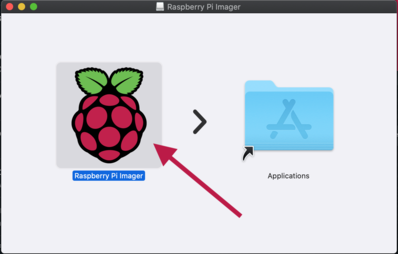  

Es öffnet sich ein neues Fenster, in welchen Sie das zu installierende Betriebssystem  auswählen können, sowie die SD-Karte. Wählen Sie bei *Operating System*  *"Raspberry Pi OS (other)"* und dann *"Raspberry Pi OS Full"* aus.  

*Abb. 4*:  Auswahl des Betriebssystems  
                      

*Abb. 5*:  Auswahl des Betriebssystems  
                    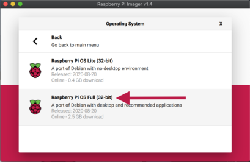  

Stecken Sie nun die SD-Karte in den Slot des Rechners. Vergessern Sie sich  hierbei, dass sich die SD-Karte im beschreibbaren Modus befindet, indem Sie den kleinen Schieber am linken Rand des SD-Karten-Adapters nach oben schieben.

*Abb. 6*:  SD-Karte beschreibbar machen, Schieber in obere Stellung bringen  
                      

Im *Raspberry Pi Imager* können Sie nun bei *"SD Card"* per Klick Ihre SD-Karte  
auswählen.  

*Abb. 7*:  Auswahl der SD-Karte  
                      

Mit einem Klick auf *"Write"* und anschließendem bestätigen können Sie schließlich  die SD-Karte bespielen, ggf. wird hierzu einmal nach dem Passwort gefragt.  Dieser Vorgang kann nun einige Minuten in Anspruch nehmen.  

*Abb. 8*:  Beschreiben der SD-Karte  
                      

Wenn der Vorgang abgeschlossen ist befindet sich das Betriebssystem für den  Raspberry Pi auf der SD-Karte und diese kann in den Raspberry Pi eingesteckt  werden. Falls Sie sich nicht für die Koffervariante mit Display entschieden haben, verbinden Sie nun einen externen Monitor, und stellen Sie sicher, dass eine Maus und Tastatur angeschlossen ist. Verbinden Sie weiter ein Ethernet-Kabel, falls Sie keine Wlan-Verbindung verfügbar haben. Anschließend können Sie den Raspberry Pi mit dem Netzteil verbinden, er startet automatisch.  
Es werden nun verschiedene Pakete automatisch installiert, was ebenfalls  mehrere Minuten dauern kann. Ist das erfolgreich geschenen, so öffnet sich ein  Fenster, in welchem Sie grundlegende Systemeinstellungen wie Zeitzone, Land,  Tastaturlayout und Ihr Wlan-Netz einstellen, sofern das gewünscht ist. Das Aufsetzen des Pi ist damit abgeschlossen und wir können mit dem Installieren von *PhyPiDAQ* fortfahren.

<a name="wieinstalliereichphypidaq"></a>

### 3.2 Installation von PhyPiDAQ auf dem Raspberry Pi

**Beziehen des PhyPiDAQ Codes und einfache Installation**

Bitte beachten Sie , dass Ihr Raspberry Pi für die folgenden Schritte mit dem Internet verbunden sein muss. Öffnen Sie das Terminal, welches Sie in der Systemleiste oben links finden.

*Abb. 9*:  Terminal öffnen  
                      


Installieren Sie zunächst *git*, mit welchem sich alle Dateien des Pakets  PhyPiDAQ* herunterladen lassen. Geben Sie hierzu folgendes in das Terminalfenster ein:
```bash
sudo apt-get install git
```

*Abb. 10*:  Befehl im Terminal eingeben  
                    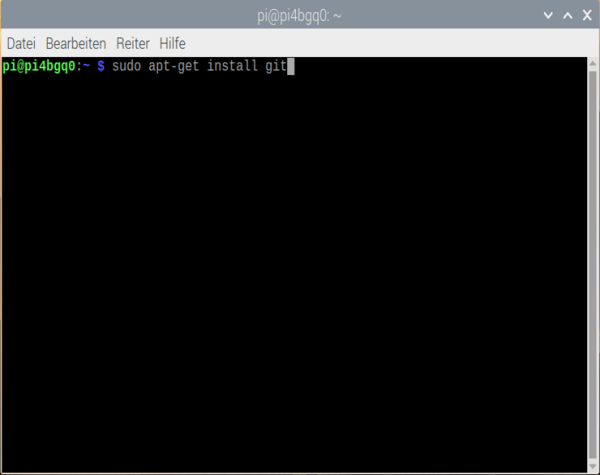  
                    
Zur Installation von *PhyPiDAQ* geben Sie folgende Befehle ein. Kopieren Sie grundsätzlich Zeile für Zeile dieses Cods in das Terminal und bestätigen Sie jeden Befehl mit der Enter-Taste. Fügen Sie **NICHT** alle Zeilen auf einmal ein.

```bash
mkdir ~/git
cd ~/git
git clone https://github.com/GuenterQuast/PhyPiDAQ
cd ~/git/PhyPiDAQ
./installlibs.sh
cp ~/git/PhyPiDAQ/phypi.desktop ~/Desktop/
```
Damit ist die Installation schon abgeschlossen und *PhyPiDAQ* ist bereit für den ersten Einsatz. 
Falls Sie später die installierte Version aktualisieren wollen geben Sie folgendes in das Terminal ein (nicht notwendig bei Erstinstallation, da bereits die aktuelle Version heruntergeladen ist):

```bash
cd ~/git/PhyPiDAQ
git pull
./installlibs.sh
```

<a name="wiebedieneichdiephypidaqsoftware"></a>

## 4. Wie bediene ich die PhyPiDAQ Software ?
<a name="startenundstartoberflaeche"></a>

## 4.1 Starten und Startoberfälche

Zum Starten der Anwendung *PhyPiDAQ*, doppelklicken Sie auf dem Desktop auf das Icon **PhyPi**.  

*Abb. 11*:  PhyPiDAQ öffnen  
                      

Sie werden gefragt, wie Sie es öffnen möchten, wählen Sie hier "*Ausführen*" aus.  
Es öffnen sich nun zwei Fenster: ein schwarzes Terminal Fenster, welches aktuelle Statusmeldungen und Log-Dateien anzeigt. Für die einfache Bedienung können Sie dieses Fenster ignorieren. Wichtig wird es erst, wenn Fehler angezeigt werden.  In diesem Fall zeigt das Terminal-Fenster den Fehlercode und Hinweise, welche auf das Problem hinzeigen und das Problem dadurch in der Regel schnell behoben  werden kann.  
Das wichtigere Fenster ist die Bedienoberfläche von *PhyPiDAQ*.  

*Abb. 12*:  Bedienoberfläche *PhyPiDAQ*  
                    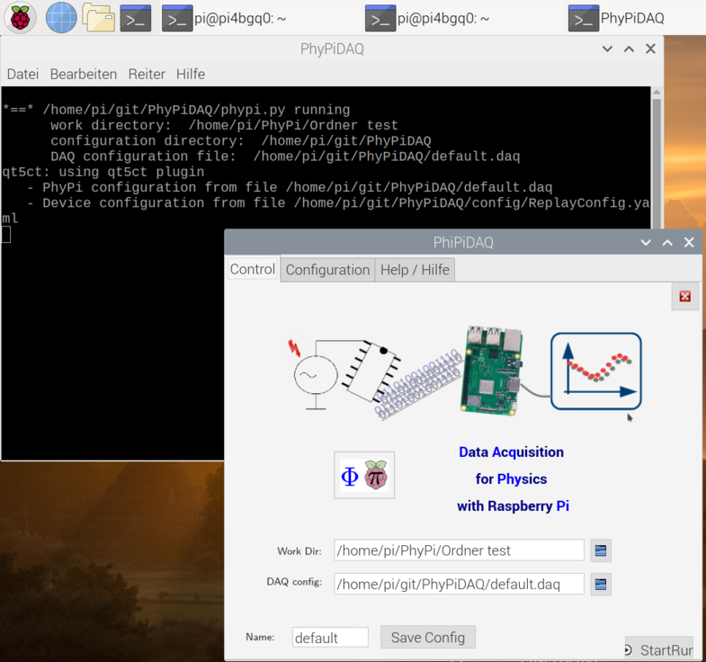  

Im Reiter "*Control"*, in welchem Sie sich nach dem Öffnen befinden, ist der Startreiter. Von hier aus kann eine Messung gestartet werden, indem der Button rechts unten "*StartRun*" geklickt wird, was aber erst später probiert werden soll. Weiter lässt sich in diesem Reiter das sogenannte Arbeitsverzeichnis auswählen. Hier können Sie bestimmen, wo der konfigurierte Versuch abgespeichert werden soll. Eine übersichtliche Ordnerstruktur ist essentiell,  wenn *PhyPiDAQ* in mehrerern Schulklassen verwendet wird. Es wird daher sehr empfohlen, eine Struktur wie die Folgende zu verwenden:  

*Abb. 13*:  Ordnerstruktur  
                      

Sie können neue Ordner im Dateimanager erstellen (ähnlich wie Windows  "Arbeitsplatz" oder Mac "Finder"), indem Sie mit der rechten Maustaste im  Fenster auf *"Neu"*->*"Ordner"* klicken.  

*Abb. 15*:  neuen Ordner erstellen  
                      

Eine andere Möglichkeit ist die Eingabe des folgenden Befehls im Terminal,  welcher den Unterordner *"Klasse_12"* im Ordner *"Schule"* erstellt.  

```bash
mkdir /home/pi/PhyPi/Schule/Klasse_12
```
Sie wählen also in der Bedienoberfläche von PhyPiDAQ in Feld *"Work Dir:"* aus,  in welchem Ordner Sie das aktuelle Projekt speichern möchten.  Darunter, in *"DAQ config*" können Sie bereits gespeicherte Projekte öffnen.  Das ist besonders dann sinnvoll, wenn Sie bereits einen Versuch im Vorraus  getestet haben und im Unterricht vorführen möchten. Es wird dann das gespeicherte Projekt genauso wieder geöffnet und Sie können den Versuch sofort starten.  
Darunter, im Feld *"Name"* können Sie den Namen des Versuchs eingeben. Dieser wird als Teil des Dateinamens erscheinen. Wenn Sie auf *"Save Config"* klicken, speichern  Sie die Konfigurationsdatei ab. Die Datei wird dann "default.daq" heißen, falls  Sie bei *Name:* "default" hingeschrieben haben. Bei jedem Starten durch "StartRun"  wird eine zusätzliche Datei erzeugt mit Name, Uhrzeit und Datum, welche in dem  Verzeichnis abgespeichert wird, welches Sie bei "Work Dir" angegeben haben, z.B.  Schule / Klasse_12 / Photoeffekt.

**Aufgabe:** Erstellen Sie nun eine wie in Abb. 30 gezeigte Ordnerstruktur,  mit Ihren Schulklassen. Erstellen Sie in eine dieser Klassen einen Ordner mit dem Namen *"Testversuch"*. Anschließend wechseln Sie zur Bedienoberfläche von  *PhyPiDAQ* und wählen in *Work Dir* den eben erstellten *Testversuch* aus.  
Vergeben Sie nun den Name "Standardversuch" und speichern Sie das Projekt ab.  
Verifizieren Sie anschließend im Dateimanager, dass sich das erstellte Projekt  dort befindet.  

<a name="konfigurationsdatei"></a>

## 4.2 Konfigurationsdatei

Wir wollen uns nun mit dem zweiten Reiter, *"Configuration"*, vertraut machen.  
Klicken Sie auf den Reiter *"Configuration"*.  

*Abb. 16*:  Konfiguration
                    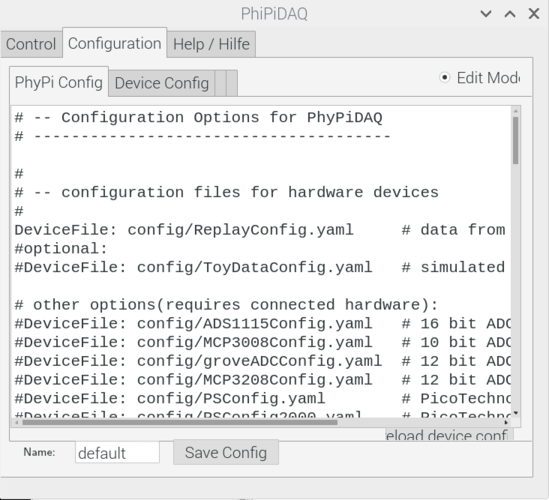  
Es ist nun ein Fenster zu sehen, in welchem sämtliche Parameter für den Versuch  
eingestellt werden können, wie beispielsweise:

- welchen Sensor verwende ich (DeviceFile)?
- welche maximalen Werte sollen im Diagramm angezeigt werden (ChanLimits)?
- sollen die Werte des Sensors direkt umrechnet werden (ChanFormula)?
- welche Achsenbeschriftung soll angezeigt werden (ChanLabels)?
- welche Einheiten sollen angezeigt werden (ChanUnits)?
- wie oft soll abgetastet werden (Interval)?  

und einige weitere ...  
Lassen Sie sich hier nicht abschrecken ! Diese Parameter stellen Möglichkeiten dar, wie ein Versuch erweitert oder perfektioniert werden kann. Es sind keinesfalls alle Parameter erforderlich - in der Regel reichen hierbei ungefähr  3-5 Zeilen aus. In der *"default"*-Config, welche in Abb. 32 zu sehen ist, sind lediglich alle Einstellmöglichkeiten aufgezeigt und durch ein "#" am Anfang  der jeweiligen Zeile auskommentiert.  

Wenn Sie Änderungen an der dieser Konfiguration vornehmen möchten, so müssen Sie zunächst oben rechts den *"Edit Mode"* aktivieren, indem Sie einmal daruf klicken.  
Dass Sie nun in der Datei schreiben können, wird durch das Feld davor angezeigt. Sie können nun direkt in der Oberfläche schreiben und auch hilfreiche, aus vielen anderen Programmen bekannte Tastenkombinationen wie 

- *Str+C* für das Kopieren von ausgewählten Zeichen 
- *Str+V* für das Einfügen der eben kopierten Zeichen 
- *Str+Z* für Rückgängig machen
- *Str+Shift+Z* für erneutes Rückgängig machen  

benutzen. 

Beginnen Sie immer damit, dass Sie der Oberfälche mitteilen, welchen Sensor  Sie auslesen möchten, indem Sie bei der entsprechenden Zeile am Anfang das "#"  entfernen.  

Wir wollen nun demonstrativ den Analog-Digital-Wandler ADS1115 auslesen und  ändern daher die Zeile

```yaml
#DeviceFile: config/ADS1115Config.yaml   # 16 bit ADC, I2C bus
```
in
```yaml
DeviceFile: config/ADS1115Config.yaml   # 16 bit ADC, I2C bus
```
um. Alle weiteren Einstellungen hier können Sie unverändert lassen, da bereits  automatisch für diesen Sensor passende Parameter gewählt werden. Für den  Sensor müssen aber ggf. noch Änderungen vorgenommen werden, da dieser beispielsweise vier Eingänge besitzt, aber ja nach Projekt nicht alle ausgelesen werden müssen. Klicken Sie hierzu nun auf *"reload device config"*, was Sie unten rechts finden. Es folgt eine Bestätigung, dass *PhyPiDAQ* nun den ausgewählten Sensor übernommen hat. 

<a name="sensorkonfiguration"></a>

### 4.2.1 Sensor-Konfiguration "Device-Config"

Klicken Sie nun oben auf den Reiter  *"Device Config"*. Es sind nun die Parameter des Sensors zu sehen.  

*Abb. 17*:  Konfiguration des Sensors  
                    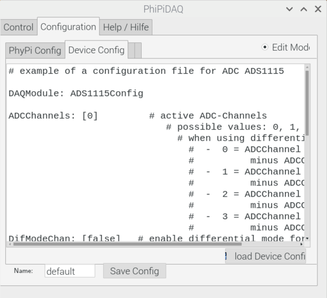  

Hier ist die Syntax wieder die gleiche, das bedeutet:  

- Zeilen, die mit "#" beginnen, sind auskommentiert und haben keinen Einfluss auf das Programm  
- um Änderungen vorzunehmen müssen Sie in den "Edit-Mode" gehen, indem Sie oben rechts das Feld "Edit-Mode" anklicken.  

Sie haben nun die Wahl, welche Kanäle Sie auslesen möchten, was in "ADCChannels" bestimmt wird. Möchten Sie nur den Kanal 1 auslesen, so lautet die Zeile  

```yaml
ADCChannels: [0]
```
da bei null mit Zählen begonnen wird. Möchten Sie nur den Kanal 2 auslesen, so lautet die Zeile  

```yaml
ADCChannels: [1]
```
Sie können mehrere Eingänge gleichzeitig auslesen, indem Sie die einzelnen Kanäle  
durch Kommata trennen:
```yaml
ADCChannels: [0, 1, 2, 3]
```
Die anderen Parameter darunter können bei Bedarf genutzt werden, um zum Beispiel  einen Eingang von einem anderen zu subtrahieren. Folgen Sie hierzu den Hinweisen  in den entsprechenden Zeilen. Zu beachten ist, dass Sie, wenn Sie mehrere Kanäle auslesen wollen, auch die Parameter unten auf die jeweilige Anzahl an Kanälen angleichen müssen. Folgendes ist also nicht möglich und wird zu einer Fehlermeldung führen:
```yaml
# example of a configuration file for ADC ADS1115

DAQModule: ADS1115Config  

ADCChannels: [0, 1, 2, 3] # active ADC-Channels
DifModeChan: [false]      # enable differential mode for Channels
Gain: [2/3]               # programmable gain of ADC-Channel
sampleRate: 860           # programmable Sample Rate of ADS1115
```
Korrekt ist:
```yaml
# example of a configuration file for ADC ADS1115

DAQModule: ADS1115Config  

ADCChannels: [0, 1, 2, 3]         # active ADC-Channels
DifModeChan: [false, false, false, false]   # enable differential mode for Channels
Gain: [2/3, 2/3, 2/3, 2/3]                # programmable gain of ADC-Channel
sampleRate: 860             # programmable Sample Rate of ADS1115
```

Wir haben nun also den Sensor *ADS1115* mit vier Kanälen ausgewählt. Sie können  nun einen Namen unten vergeben und die Konfiguration abspeichern.  

Wenn Sie den Messkoffer verwenden, ist der Aanlog-Digital-Wandler bereite mit dem Raspberry Pi verbunden und der Aufbau ist messbereit. Falls Sie einen offenen Aufbau verwenden, verbinden Sie den Analog-Digital-Wandler mit dem Raspberry Pi mit vier Leitungen benötigt: GND und +5V für die Spannungsversorgung und SCL und SDA  für die *i2C*-Verbindung, überwelche der Sensor Daten an den Pi übermittelt.  

<a name="messungstarten"></a>

## 4.3 Messung starten

Anschließend können Sie den Button *"StartRun"* klicken. Es öffnet sich ein Fenster mit dem Diagramm und Sie können unten links mit einem Klick auf *"Run"*  die Messung starten. Herzlichen Glückwunsch, Sie haben Ihre erste Messung mit *PhyPiDAQ* getätigt !  

*Abb. 18*:  Auslesen von vier Kanälen mit einem Analog-Digital-Wandler  
                    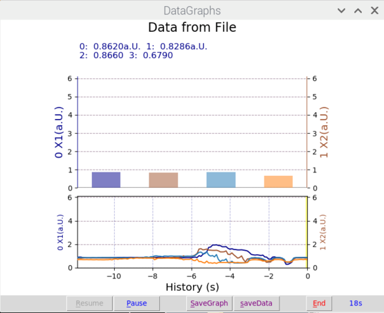  

Es gibt nun zahlreiche Möglichkeiten, wie Sie *PhyPiDAQ* einsetzten können.  
Wichtig ist hier zum Einen die Möglichkeit, aufgenommene Daten zu speichern, was mit *"SaveData"* geschieht. Die Werte werden in dem im Arbeitsverzeichnis  (*"WorkDir"*) ausgewählten Ordner in dem zur Messung gehörenden Ordner gespeichert.  
Standardmäßig werden nur die ersten 12 Sekunden abgespeichert, was genau das  Intervall ist, welches im Display zu sehen ist. In der Konfiguration kann dies natürlich angepasst und verlängert werden, falls gewünscht. Das Datenformat ist  standardmäßig *".csv"*, was aber auch angepasst werden kann. 

Für alle Buttons sind Tastaturkürzel definiert, die durch "_" im Button-Text angegeben sind. 

<a name="wiefuehreichdamitversuchedurch"></a>
## 5. Wie führe ich damit Versuche durch ?
Wir sind nun soweit, dass wir eine Vielzahl unterschiedlicher Sensoren auslesen, live im Monitor grafisch plotten und die Werte exportieren können. Das eröffnet und unzählige Möglichkeiten, *PhyPiDAQ* im Unterricht einzusetzen. Es werden nun drei Beispielversuche beschreiben, damit Sie einmal sehen, wie der gesamte  Workflow von Anfang bis Schluss aussehen kann.  


<a name="elektrostatik"></a>
### 5.1 Elektrostatik

Im folgenden Versuch soll der Effekt Influenz dargestellt werden. Des Weiteren lässt sich derselbe Aufbau ebenfalls zur Demonstration eines Ladungslöffels verwenden.  
An das Elektrometer wird eine offene, runde Kondensatorplatte mit einem Durchmesser von d ≈ 5 cm angeschlossen. Die Masse des Messkoffers wird auf  das Erdpotential gezogen. Zwischen der Kondensatorplatte und der Erde wird ein  Kondensator mit der Kapazität von 1 nF angeschlossen. Der Ausgang des  Elektrometers wird mit dem Pegelwandler verbunden und dieser wiederum mit dem  
ADC. Somit können sowohl positive, als auch negative Spannungen ausgelesen werden.  

*Abb. 19*:  Aufbau Elektrostatik-Versuch  
                      

Wir befassen uns nun mit der Konfigurationsdatei.  Aus Gründen der Übersichtlichkeit sind nun überflüssige Kommentare und auskommentierte  Zeilen ggf. weggelassen.  

**elektrostatik.daq:**

```yaml
DeviceFile: config/myADS1115Config.yaml   # 16 bit ADC, I2C bus 
ChanLabels: ['Uc']            # names for channels 
ChanUnits: ['V']         # units for channels 
ChanColors: [darkblue]      # channel colours in display
ChanFormula:
  - 2*c0-5  # chan0
Interval: 0.1                 # logging interval  
DisplayModule: DataGraphs     # text, bar-graph, history and xy-view
Title: "Data from File"       # display title
```
**myADS1115Config.yaml:** 

```yaml  
# example of a configuration file for ADC ADS1115

DAQModule: ADS1115Config  

ADCChannels: [0]       # active ADC-Channels
DifModeChan: [false]   # enable differential mode for Channels
Gain: [1]              # programmable gain of ADC-Channel
sampleRate: 860        # programmable Sample Rate of ADS1115  
```
Den *Gain* in der vorletzten Zeile müssen Sie ggf. anpassen - je nachdem,  ob das angezeigte Signal zu klein oder zu groß ist.  
Softwareseitig wird die Funktion des Pegelwandlers folgendermaßen kompensiert:  
U<sub>Kondensator</sub> = 2 · U<sub>gemessen</sub> − 5 V, was bei  *ChanFormula* bereits berücksichtigt ist.  
Bevor die Messung beginnt,  wird die Kondensatorplatte mit Hilfe eines Leiters mit dem Erdpotential  verbunden, sodass diese ungeladen ist. Wird nun ein geladener Körper der Kondensatorplatte angenähert, so bewirkt das elektrische Feld des geladenen Körpers eine Kraft auf die freien Elektronen der Kondensatorplatte, welche daraufhin - je nach Ladung des Körpers - zu diesem hin beziehungsweise von diesem weg beschleunigt werden (Influenz). Dieser Prozess wird dadurch beschränkt, dass durch die Ladungsverschiebung ein elektrisches Feld aufgebaut wird, welches der Kraft entgegenwirkt. Die Ladungstrennung kann als elektrische Spannung gemessen werden, welche zwischen Erde und der Kondensatorplatte anliegt, also gerade auf der Eingangsseite des Elektrometers.  
Es ist anzumerken, dass für diesen Versuch zwingend ein Elektrometer mit einem  sehr großen Innenwiderstand erforderlich ist, da sonst der größere Stromfluss zwischen dem Eingang des Elektrometers und der Erde zu einem Ladungsausgleich an der Kondensatorplatte führt.
Mit  einem herkömmlichen Multimeter ist der Effekt nicht sichtbar. 
Als Körper wird ein Kunststoffstab verwendet, welcher an einem Wollpullover gerieben wurde,  sodass dieser sich aufgeladen hat. Anschließend wird er der Kondensatorplatte angenähert, wobei der Abstand mehrmals variiert wird. Die aufgenommene Kurve in Abbildung unten zeigt den zeitlichen Verlauf der Spannung am Kondensator an.  
Die Veränderung der Spannung mit dem Abstand des Stabs ist gut zu erkennen.  Anhand des Vorzeichens der Spannung ist weiter zu erkennen, dass der Stab positiv geladen ist. 

*Abb. 20*:  **Influenz** Zeitlicher Verlauf der Spannung am Kondensator bei  mehrmaliger Veränderung des Abstandes zum geladenen Stab.  
                      

Nun folgt die Demonstration des Ladungslöffels. Hierzu wird eine Metallkugel  an einem Wollpullover gerieben und anschließend die entladene Kondensatorplatte damit berührt. In der Abbildung ist der Verlauf der Spannung zu sehen. Der Anstieg der Kondensatorspannung bei Berührung mit der Kugel lässt auf die Ladung  schließen. Mit ∆Q = C · ∆U, einer bekannten Kapazität von 1 nF und der Spannungsdifferenz von −2,7 V beträgt die übertragene 
Ladung −2,7 nC.

*Abb. 21*:  **Ladungslöffel** Zeitlicher Verlauf der Spannung am Kondensator bei Annäherung und Berührung mit einer geladenen Kugel. Bei ca. 66 s wird der Kondensator geerdet, sodass die Spannung 0 V beträgt. Bei Annäherung der geladenen Kugel steigt der Betrag der Spannung am Kondensator durch Influenz an. Bei Berührung der Kugel an der Kondensatorplatte (t ≈ 67,9 s) erreicht die Spannung einen konstanten Wert.  
                    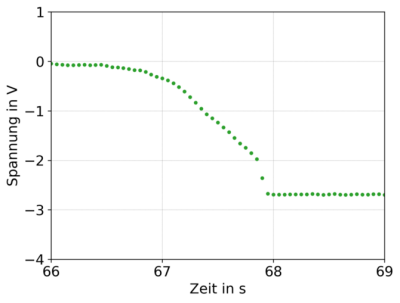  


<a name="kraftsensor"></a>
### 5.2 Kraftsensor
Mithilfe einer Wägezelle soll eine Kraftmessung durchgeführt werden. Es  wird überprüft, ob die an der Wägezelle anliegende Spannung linear mit der angehängten Masse ansteigt, wie es erwartet wird.  

Der schematische Aufbau ist nachfolgend dargestellt:

*Abb. 22*:  **Kraftsensor** schematischer Aufbau  
                      

Die verwendete Wägezelle kann nach [dieser Anleitung](docs/Bauanleitung_Kraftsensor.pdf) nachgebaut werden. 

Zunächst wird die Wägezelle mit einer Betriebsspannung von *U=5V* versorgt und an eine Vorrichtung geschraubt, sodass Massestücke daran angehängt werden können. Die Spannungsdifferenz der beiden Ausgänge der Wägezelle ist ein Maß für die anliegende Kraft. Da dieser Unterschied typischerweise im *mV*-Bereich liegt, wird eine Verstärkung der Spannung mit dem Instrumentenverstärker vorgenommen. Der Ausgang des Instrumentenverstärkers wird mit dem Eingang A0 des ADC verbunden. Da der notwendige Verstärkungsfaktor unbekannt ist, wird dieser zunächst  klein eingestellt und während der Messung anschließend erhöht, bis sich das Signal in einem geeigneten Wertebereich befindet. Da die Polarität der Spannung ebenfalls unbekannt ist, wird eine Referenzspannung abgegriffen und mit dem dazugehörigen Anschluss des Instrumentenverstärkers verbunden. 
Diese verschiebt die Ausgangsspannung um den Wert der Referenzspannung, sodass negative Spannungen zu positiven Spannungen verschoben werden können. Es können ca. 2-3V verwendet werden, wobei der genaue Wert der Referenzspannung  unerheblich ist, da diese Spannung anschließend wieder abgezogen wird. Dazu wird die Referenzspannung an den Eingang A1 des ADC angelegt und A0 - A1 als Ausgabe gewählt.  

Ist der Aufbau abgeschlossen, so kann die Messung gestartet und mit verschiedenen Massen der Verstärkungsfaktor so gewählt werden, dass eine Spannung sichtbar ist. Der Verstärkungsfaktor beträgt hier *A = 18*. Bei laufender Messung werden nacheinander Massestücke bis 500 g in 50 g Schritten an die Wägezelle gehängt.  
Des Weiteren wird die Spannung aufgenommen, wenn kein Massestück angehängt ist.  Anschließend werden die Messwerte exportiert und die Spannungen den jeweiligen angehängten Massen zugeordnet. Durch zeitliches Mitteln der Spannungswerte während der Zeit, als das jeweilige Massestück angehängt war, kann jeder Masse ein Spannungswert zugeordnet werden. Es ergeben sich somit zehn Spannungswerte zu den  zehn Massestücken. Es ist zu erkennen, dass die Spannung proportional  zur angehängten Masse ist. Die Spannung, welche gemessen wird, ohne dass ein Massestück angehängt ist, wird als Offset-Spannung von den anderen Spannungen abgezogen. Nach Bestimmung der Ausgleichsfunktion kann diese Wägezelle somit als Waage für Massen bis 500 g eingesetzt werden.  

*Abb. 23*:  Die Spannung der Wägezelle steigt mit zunehmender Kraft an.  
Die Offset-Spannung, welche ohne ein angehängtes Massestück anliegt, wird von den restlichen Spannungswerten abgezogen. Die gemessenen Werte sind mit einer Ursprungsgeraden kompatibel.  
                      
 
Die Regression kann entweder direkt in *PhyPiDAQ* mit der Funktion *ChanCalib*  vorgenommen werden, oder die Werte werden exportiert und anschließend in Excel,  Python, ect. weiter verarbeitet.  

Konfigurtionsdatei **kraftsensor.daq:**

```yaml
DeviceFile: config/kraft_ADS1115Config.yaml   # 16 bit ADC, I2C bus
ChanLabels: ['Spannung']            # names for channels 
ChanUnits: ['V']         # units for channels 
ChanColors: [darkblue]      # channel colours in display

Interval: 0.05                 # logging interval         
NHistoryPoints: 20000          # number of points used in history buffer, time=NHistoryPoints*Interval = 2000*0.05 = 100 seonds
DisplayModule: DataGraphs     # text, bar-graph, history and xy-view
Title: "Data from File"       # display title
DataFile:   null              #  null to disable 
CSVseparator: '   '            # field separator, set to ';' for German Excel   
```

**kraft_ADS1115Config.yaml:**

```yaml
DAQModule: ADS1115Config  
ADCChannels: [0]
DifModeChan: [true]
Gain: [1]
sampleRate: 860
```

<a name="photoeffekt"></a>

### 5.3 Photoeffekt

Im Folgenden wird der Photoeffekt genauer untersucht. Es soll für sechs verschiedene Wellenlängen im Bereich von λ = 360 nm bis λ = 590 nm jeweils die sich ergebende Gegenspannung gemessen werden. Anschließend soll das Verhältnis *h/e*, wobei *h* das Plancksche Wirkungsquantum und *e* die Elementarladung ist, bestimmt werden.  

Als Lichtquelle wird eine Quecksilber-Lampe verwendet, da diese auch im UV-Bereich Licht emittiert. Mit Linsen wird der Lichtstrahl gebündelt und mit Interferenzfiltern die jeweilige Wellenlänge ausgewählt. Durch das Auftreffen der Photonen auf der Kathode werden Elektronen herausgelöst und auf der zunächst neutral geladenen Platte stellt sich ein positiver Ladungsüberschuss ein. Treffen Elektronen auf die gegenüberliegende Anode, so wird diese negativ geladen. Durch die Ladungstrennung zwischen Anode und Kathode entsteht ein ansteigendes elektrisches Feld, welches weitere Elektronen, die von der Kathode zur Anode fliegen, abbremst. Im Gleichgewicht ist die Bremskraft so groß, dass selbst Elektronen mit maximaler kinetischer Energie nicht mehr bei der Anode ankommen. Die Spannung zwischen Kathode und Anode ist dann maximal. Die maximale Spannung entspricht dann der Gegenspannung.  

Die Messmethode, die hier verwendet wird, enthält einen parallel zur Photozelle geschalteten Kondensator, der sich durch die Photospannung auflädt. Die Spannung, die sich einstellt, entspricht der Gegenspannung. Diese Methode hat den Vorteil,  dass auf eine eher aufwendige und mühselige Einstellung des Photostroms verzichtet werden kann. Dadurch kann dieser Versuch in sehr kurzer Zeit und mit hoher Genauigkeit bewerkstelligt werden.   

Hardwareseitig wird die Spannung mit dem Elektrometer gemessen, da hier ein  großer Innenwiderstand benötigt wird, um die Messung nicht zu verfälschen.  Ein handelsübliches Multimeter ist daher ungeeignet. Der Schaltaufbau ist in der nachfolgenden Abbildung zu sehen:

*Abb. 24*:  **Photoeffekt** schematischer Aufbau
                    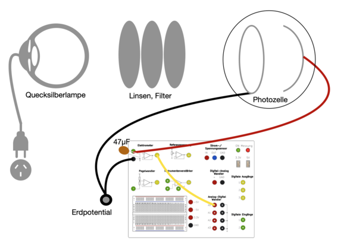  
Der Kondensator mit *C=47µF* muss ggf. angepasst werden, falls die Aufladung zu schnell oder zu langsam erfolgt.

In *PhyPiDAQ* kann folgende Config verwendet werden. (Die Plots weiter unten wurden erstellt, indem die Werte von *PhyPiDAQ* als *.csv* exportiert und anschließend in einem Python Script eingelesen wurden. Dies kann für die Mittelstufe beispielsweise genauso gut mit einer Exceltabelle oder ähnlichem erstellt werden.)

***photoeffekt.daq:**

```yaml
DeviceFile: config/photoeffekt_ADS1115Config.yaml   # 16 bit ADC, I2C bus
ChanLabels: ['Spannung']            # names for channels 
ChanUnits: ['V']         # units for channels 
ChanColors: [darkblue]      # channel colours in display

Interval: 0.05                 # logging interval 
NHistoryPoints: 20000          # number of points used in history buffer, time=NHistoryPoints*Interval = 2000*0.05 = 100 seonds
DisplayModule: DataGraphs     # text, bar-graph, history and xy-view
Title: "Data from File"       # display title
DataFile:   null              #  null to disable 
CSVseparator: '   '            # field separator, set to ';' for German Excel   
```

*photoeffekt_ADS1115Config.yaml:*
```yaml
DAQModule: ADS1115Config  
ADCChannels: [0]
DifModeChan: [false]
Gain: [1]
sampleRate: 860
```
Die Messung kann nun gestartet werden und die Gegenspannung wird dargestellt, welche sich  aus der Aufladung des Kondensators durch den Photoeffekt ergibt. Zum Entladen wird der Kondensator wieder mit Masse verbunden.  

Die Grafik unten zeigt den jeweiligen Spannungsverlauf für verschiedene Farben des einfallenden Lichts. Wichtige Beobachtungen sind: 
  - die Spannungen über dem Kondensator saturieren abhängig von der Farbe
  - der Spannungsanstieg ist jeweils unterschiedlich und hängt von der Lichtintensität ab.

*Abb. 25*:  **Photoeffekt** Aufladung eines Kondensators an einer Vakuum-Photozelle für verschiedene Wellenlängen des einfallenden Lichts
                    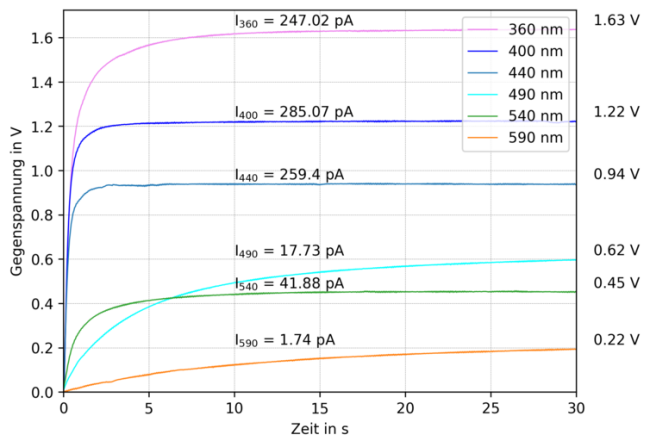  


Um das Verhältnis *h/e* zu berechnen, wird zunächst die Energiebilanz aufgestellt.  
Das einfallende Licht mit der Wellenlänge *λ* hat die Frequenz *f = λc* und die Energie
 *E<sub>Licht</sub> = hf*.  
Die herausgelösten Elektronen haben nach Abzug der Austrittsarbeit die kinetische Energie
 *E<sub>kin</sub> = E<sub>Licht</sub> − E<sub>A</sub>*.  
Für die von den Elektronen im elektrischen Feld aufgenommene Energei gilt:  
*E<sub>Feld</sub> = U · e*,
wobei *U* die Gegenspannung und *e* die Elementarladung ist.  
Im  stationären Fall ist die Energie des elektrischen Feldes gleich groß wie die kinetische Energie *E<sub>Feld</sub> = E<sub>kin</sub>*, sodass sich eingesetzt 
*U·e=hν−E<sub>A</sub>* 
ergibt.  
Für die Spannung *U* gilt schließlich: *U = h/e · f + e·A*.

Das Verhältnis *h/e* entspricht  der Steigung im *U*−*f*-Diagramm in der Abbildung unten. 
Der y-Achsenabschnitt entspricht  der Austrittsarbeit *E<sub>A</sub>*, wobei ein negatives Vorzeichen dafür steht, dass diese  Arbeit aufgebracht werden muss. 
Die Abweichung von *(h/e)<sub>gemessen</sub>* zum Literaturwert von *h/e = 4,14 ·10−15 Js/C* beträgt 3,5%, für den betriebenen Aufwand also eine beachtliche Genauigkeit.  
Die Austrittsarbeit für eine Kalium-Kathode beträgt *E<sub>A</sub> = 2,25 eV*. 
Der y-Achsenabschnitt  entspricht *|eU| = 1,97eV*. Da hier keine weiteren Effekte wie zum Beispiel  Kontaktspannungen berücksichtigt werden, ist die Bestimmung der Austrittsarbeit mit diesem Verfahren grundsätzlich nur mit größeren Unsicherheiten möglich.  
Weiter lässt sich aus der Kondensatoraufladung  in der Abbildung unten der Photostrom berechnen. Es ist zu sehen, dass dieser im  pA-Bereich liegt. Bei 590 nm Wellenlänge war der Strom am kleinsten, was sich an der verhältnismäßig langsamen Aufladung zeigt.

*Abb. 26*:  **Photoeffekt**  Gegenspannung gegen Frequenz des Lichts, aufgetragen mit linearer Regression. Die Geradensteigung entspricht dem Verhältnis *h/e*.  
                    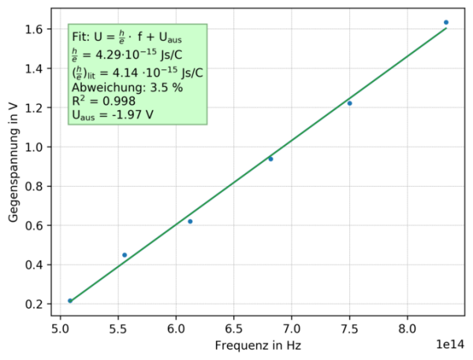  


