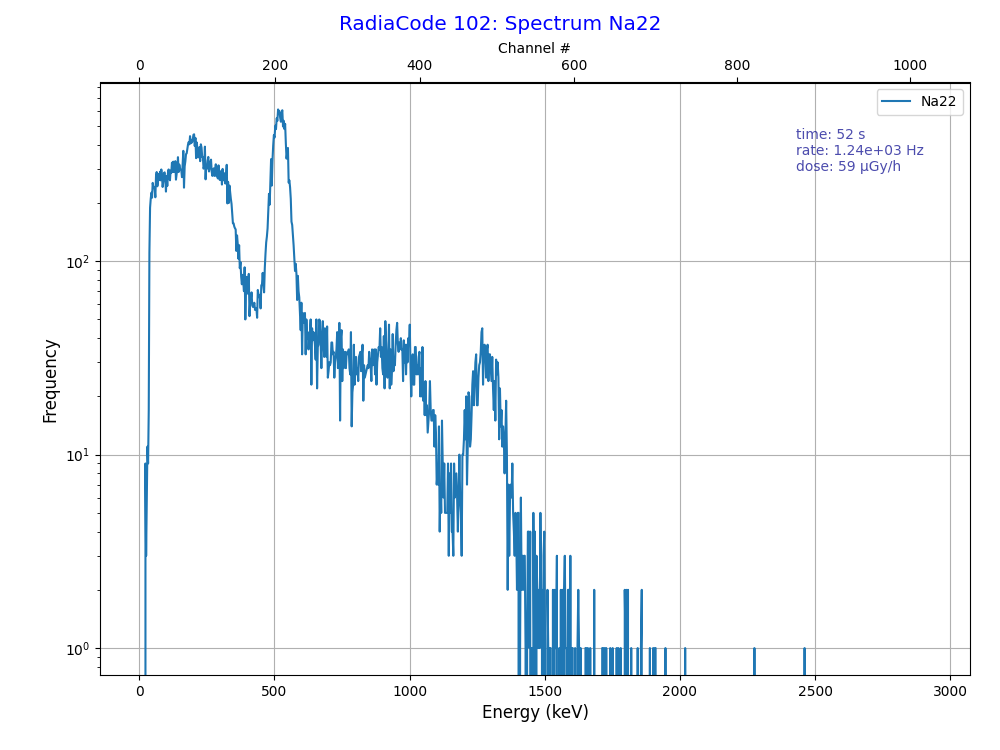

## *PhyPiDAQ*: Gamma spectroscopy with Radiacode 102

Measurements of gamma ray spectra usually require complex and expensive equipment.
With the advancement of modern sensor technology, in particular Siilocon-Photomultipliers  (SiPM) for the detection of low-intensity visible light at low noise levels,
new perspectives have opened up. 

### The Radiacode 102 device

A novel device on the market is the  [Radiation Detector and Spectrometer RadiaCode 102](https://radiacode.com) , which uses a 1 cm³ CsI(Tl) crystal with a SiPM sensor with temperature correction. It measures the deposited energies of gamma rays from radioactive decay and provides raw output data in form of a spectrogram, i.e. a frequency distribution of histogram of recorded pulse heights provided by the SiPM sensor.
Data is exported via USB and Bluetooth interfaces.  An Android App as well as a windows program exist in addition to a [python library](https://github.com/cdump/radiacode) to display and analyze the sensor data. An adapter (*RC10xConfig.py) is also available to display and analyze data within the *PhyPiDAQ* framework.

An up to now unique selling point of the RadiaCode device is its ability to run on battery power for about 100 h, with an internal memory to save rate and dose histories as well as the accumulated spectrum. Out-door measurements with real-time monitoring  of recorded data via the mobil-phone app and subsequent analysis are easily possible.

The RadiaCode App for mobile phones and the Windows program are already very powerful. The do not, however, primarily address the needs and goals of physics education, but address practical applications like dosimetry or the radioactivity of food and other probes. The screen shot below illustrates the possibilities. Shown is the very feature-rich gamma  spectrum of a Thorium 232 source recorded over almost 4 hours
with a  gas mantle ("Glühstrumpf") in a led container. The average count rate was
approximately 160 Hz, the total dose, if absorbed by human tissue, would have been 
10.8 µSv. The App contains a data base with gamma energies of the most frequent sources. In the picture below, all of the lines expected for Thorium-232 can clearly identified, including the associated Compton edges. The rates observed for higher energies are smaller than expected; this is a consequence of the unavoidingly 
decreasing efficiency  of the 1 cm³ crystal with energy.

   

### Gamma spectra with *PhyPiDAQ*

For an introductroy physics course on the properties of gamma rays and the basics of gamma spectroscopy, the App and Program supplied by the vendor appear too complex.
By exporting the data, or directly reading the spectra from the device, a simpler graphical display and a direct analysis of the raw input data, i.e. the frequency distribution of pulse heights in 1024 channels, becomes possible. The same spectrum as above is shown in
the PhyPiDAQ-style representation below. A translation of channel number to deposited
gamma-energy has already been performed. The derived data shown in the upper right corner are directly calculated from the spectrum.  Note that the dose is calculated from
the total energy deposited in the CsI(Tl) crystal, taking into account the volume and density of CsI. No conversion of deposited energy (in units Gy) to an effective dose (in units Sv) is attempted. 

  

*PhyPiDAQ* supports live measurements with *RadiaCode 102* by connecting it to 
a computer via USB. The live measruement show the actual differential spectrum, i.e.
the gamma energies recorded in the last interval, and the accumulated spectrum. 
The transformation of histogram channels **C to energies *E* is performed by a quadratic function, $E = a_0 + a_1\cdot C + a_2 \cdot C^2$. The parameters are either
read from the device during initialization or, alternatively, provided by the user. The
total deposited energy is shown in units of keV; with known parameters of the detection device, this can easily be converted to Gy= J/Kg. 

   

The setup shown here is well suited for introductory courses on radioactivity, the interaction of gamma rays in matter and gamma spectroscopy. Thanks to the availability of radioactive sources in most physics labs, simple spectra, e.g. from Cs-137, Co-60 or Na-22 sources, can be studied and used to fix the calibration of the device. More complex spectra, e.g. from the Thorimum-232 chain as shown above, can be considered. The high sensitivity of a CsI(Tl) crystal compared to a Geiger tube permits rather fast studies on the radioactivity contained in environmental probes, either biological ones (K-60 in bananas, Radium in para-nuts), Radon in probes of air, e.g. collected on the surface of a balloon, 
 or minerals like granite or others containing remnants of Thorium and Uranium. 
 
Some examples are shown in the figures below.
 
  
 
  
 
  

   

 