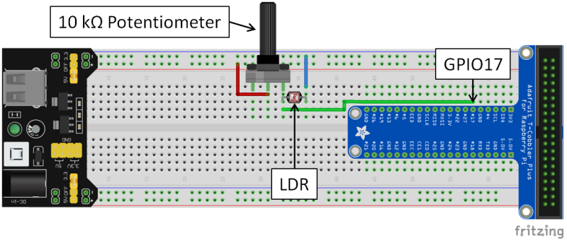
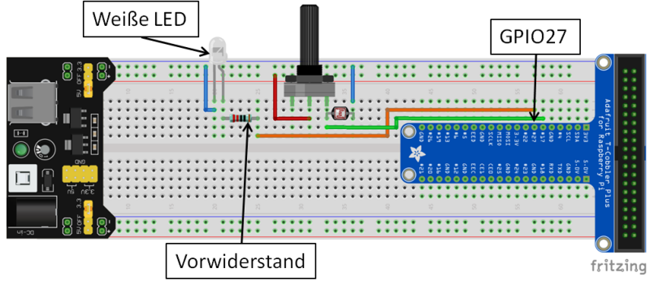

# Light-dark switching circuit 

As a very simple example for digital read-out and control  is the
switching of a light source, in this case a light-emitting diode (LED) 
with a light-dependent resistor (LDR). This example illustrates the
simple "digitisation" of an analogue input using a GPIO port of
a Raspberry Pi and the display of the result using another GPIO port. 

## Circuit design and realisation

**Material:**

 + 10 k&Omega; potentiometer
 + 220 &Omega; series resistor for LED (colour code: red, red, black, black, brown)
 + photoresistor (LDR type5516)
 + white LED
 + breadboard with power supply and power supply unit
 + breadboard cables in different colours
 + Raspberry Pi
 + ribbon cable

**Procedure:**

The principle of the circuit to connect the LED, our sensor, to a GPIO pin of
the Raspberry Pi looks like this: 


The real circuit on a bradboard is sketched here:

  

Build the circuit onto the breadboard according to the figure. 
After carefully checking the circuitry, switch on the power supply of the 
breadboard.

To see what happens we re-use the program *ditital.py* from the example
*DigitalMeasurement*: 

```python
import RPi.GPIO as GPIO #  import GPIO library
import time # import library "time".  

GPIO.setmode(GPIO.BCM) # specify pin numbering scheme
GPIO.setup(17, GPIO.IN) # use GPIO pin 17 as input 

try: # execute program code
    while True: # loop
  		print("Status GPIO17: ", GPIO.input(17)) # show status of pin 17
  		time.sleep(0.1) # wait 0.1 s (Raspberry Pi "sleeps")
except KeyboardInterrupt: # when interrupting with Cntrl+C ... 
  	GPIO.cleanup() # ... clean up.
```

As before, run the program and turn the potentiometer knob while watching
the output. Change the light-level falling on the LDR by holding you hand
over it and repeat changing the potentiometer knob. Find the switching 
threshold of the GPIO pin and adjust the potentiometer such that the 
reported value is 1.  Now remove your hand and watch the output. As you 
will see, the value of the GPIO input now depends on the amount of incident
light on the LDR - you have built your own light sensor!

The potentiometer setting determines the switching threshold, which should
be adjusted depending on the background light level. 

With the digital signal from the GPIO input you can now do trigger many
other things. Here, we will simply switch on a little light - a light-emitting
diode (LED) when the light level is low. To achieve this, extend your circuit
as shown here:



In addition, our program needs a small modification and extension: 

```python
import RPi.GPIO as GPIO #  import GPIO library
import time # import library "time".  

GPIO.setmode(GPIO.BCM) # specify pin numbering scheme
GPIO.setup(17, GPIO.IN) # use GPIO pin 17 as input 

try: # execute program code
    while True: # loop
    ## --> new code <--
        statusGPIO17 = GPIO.input(17) # state of GPIO-Pin 17
        if statusGPIO17 == 1:          # if 1 ...
            GPIO.output(27, GPIO.HIGH) # ... switch on LED
        if statusGPIO17 == 0:          #  if 0, ...
            GPIO.output(27, GPIO.LOW)  # ... switch off LED
    ## --> end new code <--
  	    time.sleep(0.1) # wait 0.1 s (Raspberry Pi "sleeps")
except KeyboardInterrupt: # when interrupting with Cntrl+C ... 
  	GPIO.cleanup() # ... clean up.
```

If you run this program, your Raspberry Pi will take care of switching
on the light when it becomes dark!
