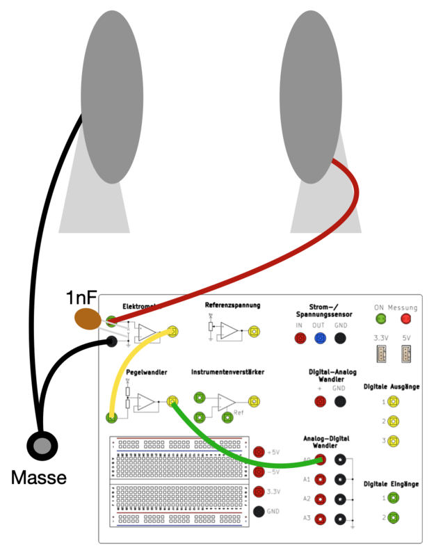

# *PhyPiDAQ*: Experiments on Electrostatics 

Measurements of charges and with capacitors are also possible with small voltages that are harmless
to pupils, if a very high-power amplifier is used  with which voltage measurements can be made without
disturbing current flow. For this purpose, one can use the operational amplifier A 3140 with an internal
resistance >10¹² Ohm, with which an "electrometer circuit" can easily be realised and which is also included
in the construction proposal for a generally applicable [amplifier board](https://github.com/PhyPiDAQ/MeasuringCase).

In the following experiment, the effect of electrostatic influence will be shown. 
Furthermore, the same setup can also be used to demonstrate a load spoon.  

An open, round capacitor plate with a diameter of d ≈ 5 cm is connected to the 
electrometer. The mass of the measuring case is pulled to the earth potential. 
A capacitor with a capacity of 1 nF is connected between the capacitor plate 
and the earth. The output of the electrometer is connected to the level converter 
and this in turn to the ADC. This means that both positive and negative 
voltages can be read out.

**elektrostatik.daq:**
*Fig. 1*: Electrostatic experiment setup  
                      

We now deal with the configuration file. For the sake of clarity, superfluous comments and 
lines that have been commented out have been left out.
```bash
DeviceFile: config/myADS1115Config.yaml   # 16 bit ADC, I2C bus 
ChanLabels: ['Uc']            # names for channels 
ChanUnits: ['V']         # units for channels 
ChanColors: [darkblue]      # channel colours in display
ChanFormula:
  - 2*c0-5  # chan0
Interval: 0.1                 # logging interval 
DisplayModule: DataGraphs     # text, bar-graph, history and xy-view
Title: "Data from File"       # display title
```
**myADS1115Config.yaml:** 
```bash  
# example of a configuration file for ADC ADS1115

DAQModule: ADS1115Config  

ADCChannels: [0]         # active ADC-Channels
DifModeChan: [false]   # enable differential mode for Channels
Gain: [1]                # programmable gain of ADC-Channel
sampleRate: 860             # programmable Sample Rate of ADS1115  
```
You may have to adjust the *Gain* in the penultimate line - depending on whether 
the displayed signal is too small or too large. On the software side, the function 
of the level converter is compensated as follows:  
U<sub>capacitor</sub> = 2 · U<sub>measured</sub>-5V, which is already taken 
into account in *ChanFormula*.  
Before the measurement begins, the capacitor plate is connected to earth potential 
using a conductor so that it is uncharged. If a charged body is brought closer to the capacitor plate, the electric 
field of the charged body causes a force on the free electrons of the capacitor plate, which then - depending on the 
body's charge - are accelerated towards or away from it (electrostatic influence). This process is limited by the fact 
that an 
electric field is built up through the charge shift, which counteracts the accelerating force.
  
The charge separation can be measured as an electrical voltage between earth and the capacitor plate, i.e. precisely on 
the input side of the electrometer. It 
should be noted that an electrometer with a very high internal resistance is 
absolutely necessary for this experiment, as otherwise current flow 
between the input of the electrometer and the earth leads to a charge equalization 
on the capacitor plate and the effect is therefore not visible. The effect is not 
visible with a conventional multimeter. A plastic rod is used as the body, which 
was rubbed on a wool sweater so that it became charged. Then it is brought closer 
to the capacitor plate, the distance being varied several times. 

Fig. 2 below shows the time course of the voltage across the capacitor. The 
change in voltage with the distance between the rods can be clearly seen. The sign 
of the voltage also shows that the rod is positively charged. 

*Fig. 2*: **Influence** Time curve of the voltage on the capacitor with repeated
changes in the distance to the charged rod.  
                      

Now the demonstration of the electrical charge spoon follows. To do this, a metal ball is 
rubbed on a wool sweater and then the discharged capacitor plate is touched with it. The 
illustration shows the course of the voltage. The increase in the capacitor voltage  
upon contact with the sphere indicates the charge. With Q = C · U, a known 
capacitance of 1 nF and the measured voltage difference of −2.7 V, the transferred charge 
is determined to be −2.7 nC.

*Fig. 3*: **Electric Charge spoon** Time curve of the voltage on the capacitor when 
approaching and touching a charged ball. At approx. 66 s the capacitor is grounded 
so that the voltage is 0 V. When the charged sphere approaches, the amount of 
voltage on the capacitor increases due to influence. When the ball touches the 
capacitor plate (t ≈ 67.9 s), the voltage reaches a constant value.  
                      
