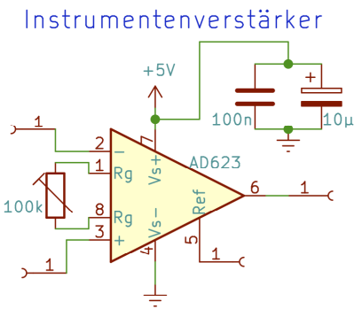
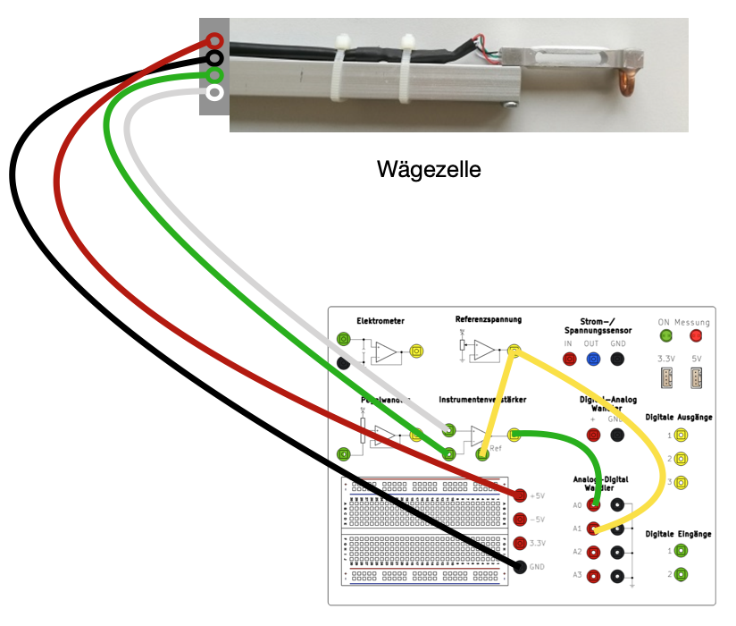
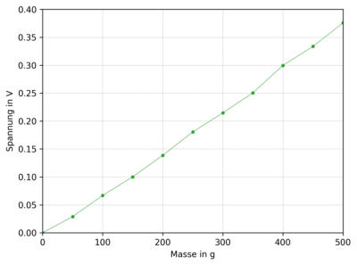

# *PhyPiDAQ*: Experiments with a Force Sensor

A force measurement is to be carried out using a load cell. It is checked whether the voltage 
applied to the load cell increases linearly with the attached mass. This measurement serves
to calibrate the force sensor.

Since the relative change in resistance of strain gauges is only small, a Wheatsone bridge of 
four strain gauges is used for measurement. Because the signal is still small, 
it is recommended to use an instrumentation amplifier as shown in Fig. 1.

*Fig. 1*:  **Instrumentation amplifier** for measuring small voltages.  
                      

If the signal is to be recorded with an analogue-to-digital converter connected to the 
Raspberry Pi, you should consider applying a voltage to the reference input of the 
instrumentation amplifier, which sets the zero position and thus raises the output voltage 
to the range of 0- 5V. 

## Calibration of a strain gauge force gauge

The schematic layout of the experiment is shown in the Figure below.

*Fig. 2*: **force sensor** schematic structure  
                      

The load cell used can be rebuilt according to 
[these instructions](../docs/Bauanleitung_Kraftsensor.pdf).  

First, the load cell is supplied with an operating voltage of U=5V and screwed 
to a device so that weights can be attached to it. The voltage difference between 
the two outputs of the load cell is a measure of the applied force. Since this 
difference is typically in the mV range, the voltage is amplified using the 
instrumentation amplifier. The output of the instrumentation amplifier is connected 
to input A0 of the ADC. Since the necessary gain factor is unknown, it is initially 
set small and then increased during the measurement until the signal is in a 
suitable value range. Since the polarity of the voltage is also unknown, a 
reference voltage is tapped and connected to the associated connection of the 
instrumentation amplifier. 

This shifts the output voltage by the value of the reference voltage so that 
negative voltages can be shifted to positive voltages. Approx. 2-3V can be used, 
whereby the exact value of the reference voltage is irrelevant, as this voltage is 
then subtracted again. To do this, the reference voltage is applied to input A1 of 
the ADC and A0 - A1 selected as the output.

Once the setup is complete, the measurement can be started and the amplification 
factor selected with different masses so that a voltage is visible. The gain factor 
here is A=18. While the measurement is in progress, pieces of weight up to 
500 g are hung on the load cell in 50 g increments. In addition, the voltage is 
taken up if no mass is attached.  
The measured values ​​are then exported and the stresses are assigned to the 
respective attached masses. By averaging the voltage values ​​over time during the 
time when the respective piece of mass was attached, a voltage value can be 
assigned to each mass. This results in ten voltage values ​​for the ten pieces of 
mass. It can be seen that the voltage is proportional to the attached 
mass. The voltage that is measured without an attached mass is subtracted from 
the other voltages as an offset voltage. After determining the compensation 
function, this load cell can be used as a scale for masses of up to 500 g.

*Fig. 3*: The voltage of the load cell increases with increasing force. The 
offset voltage that is applied without an attached mass is subtracted from the 
remaining voltage values. The measured values ​​are compatible with a straight line 
through the origin.  
                      

The regression can either be carried out directly in *PhyPiDAQ* with the *ChanCalib*  
function, or the values are exported and then transferred to Excel, Python, etc. for
further processing. 

*Config file*:

*kraftsensor.daq:*
```yaml
DeviceFile: config/kraft_ADS1115Config.yaml   # 16 bit ADC, I2C bus
ChanLabels: ['Spannung']            # names for channels 
ChanUnits: ['V']         # units for channels 
ChanColors: [darkblue]      # channel colours in display

Interval: 0.05                 # logging interval         
NHistoryPoints: 20000          # number of points used in history buffer, time=NHistoryPoints*Interval = 2000*0.05 = 
100 seonds
DisplayModule: DataGraphs     # text, bar-graph, history and xy-view
Title: "Data from File"       # display title
DataFile:   null              #  null to disable 
CSVseparator: '   '            # field separator, set to ';' for German Excel   
```

*kraft_ADS1115Config.yaml:*
```yaml
DAQModule: ADS1115Config  
ADCChannels: [0]
DifModeChan: [true]
Gain: [1]
sampleRate: 860
```
